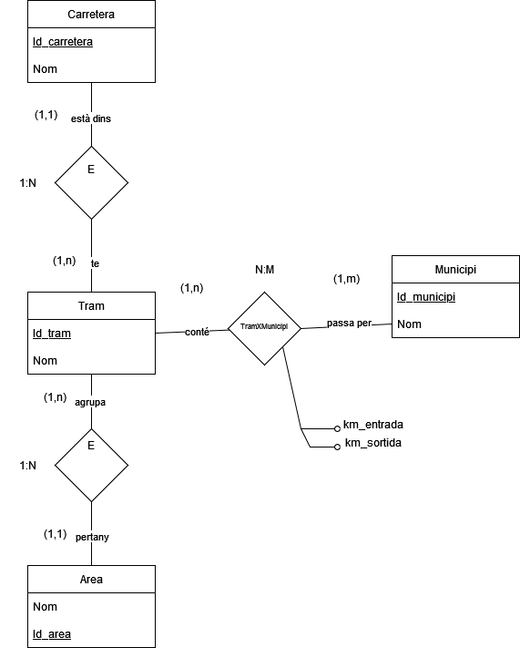

# 1. Careterres

Dissenyar una base de dades que contingui informació relativa a totes les carreteres d'un determinat país. Es demana realitzar el disseny en el model E/R, sabent que:

- En aquest paıs les carreteres es troben dividides en trams.
- Un tram sempre pertany a una única carretera i no pot canviar de carretera.
- Un tram pot passar per diversos termes municipals, sent una dada d'interès al km. del tram pel qual entra en dit terme municipal i al km. pel qual surt.
- Hi ha una sèrie d'àrees en les que s'agrupen els trams, cada un dels quals no pot pertànyer a més d'una àrea.

# 2. Model conceptual

## 2.1. Enllaç públic a l'esquema

[cas 4_carreteres](https://drive.google.com/file/d/1VdCW2dSnQXPr92zz5BfDT5iQA4ip2ICT/view?usp=sharing)

## 2.2. Esquema conceptual (EC ó ER)

  

# 3. Model lògic relacional

## 3.1. Esquema lògic

Carretera (<ins>Id_carretera</ins>, Nom)  
Municipi(<ins>id_municipi</ins>, nom)  
Area (<ins>Id_area</ins>, Nom)  
Tram (<ins>Id_tram</ins>, Nom, Id_carretera, id_area)  
TramXMunicipi (<ins>Id_tram, Id_municipi</ins>,km_entrada, km_soritda)  

## 3.2. Diagrama referencial

Relació referencial|Clau aliena|Relació referida
-|-|-
Tram | Id_carretera | Carretera
Tram | Id_Area | Area
tramXMunicipi | id_tram | Tram
tramXMunicipi | id_municipi | Municipi

