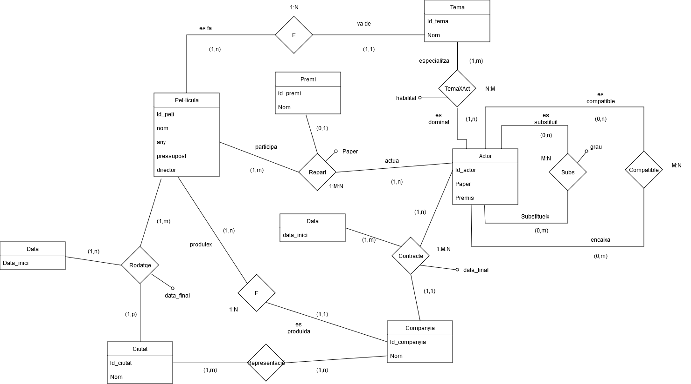

# 1. Cinèfil

Un cinèfil aficionat a la informàtica vol crear una Base de Dades que reculli informació diversa sobre el món cinematogràfic, des dels orígens del cinema fins a avui mateix, amb el contingut que es descriu a continuació. 
- Lògicament, vol tenir classificades moltes pel.lícules, que vindran identificades per un codi. També vol de cadascuna el nom, l’any de l’estrena, el pressupost, el director, etc.  
A més, de cada pel.lícula vol conéixer també quins actors van intervenir, així com el paper que hi representàven (actor principal, secundari, etc.) i el possible premi que va rebre per la seva interpretació.
- Les pel.lícules són d’un tema determinat. Es ben sabut que hi ha actors especialitzats en un tema, encara que un actor és capaç d’interpretar varis temes amb diferent “habilitat”.
- Com que el nostre cinèfil és una mica curiós, vol emmagatzemar també dades personals dels actors, que ha anat recollint al llegir revistes del món artístic. Per exemple, quins actors són en certa manera substitutius d’altres, amb un grau de possible substitució que pot anar de 1 a 10. També quins actors són “incompatibles”, o sigui, que mai han treballat ni treballaran junts amb una mateixa pel.lícula o escena.
- Els actors estan contractats, en un moment donat per una companyia, però poden canviar si tenen una oferta millor. També poden retornar a una companyia en la que ja hi  havien treballat. Les companyies produeixen pel.lícules, però cap pel.lícula és coproduïda per dues o més companyies.
- Com que el nostre amic fa molt de turisme, vol saber, per a cada ciutat, quines companyies hi tenen representació i a quina adreça. Evidentment, les companyies solen tenir representació a quasi totes les ciutats importants. Al mateix temps, vol també informació de quines pel.lícules s’estan rodant a cada ciutat i en quin moment, tenint en compte que una pel.lícula es pot rodar a vàries ciutats i també a una mateixa ciutat en diferents fases del seu rodatge.

Qüestions

- Proposeu un esquema entitat-relació per a la BD en qüestió. Identifiqueu clarament entitats, atributs i relacions.
- Proposeu un esquema lògic relacional equivalent amb el seu corresponent diagrama referencial.

# 2. Model conceptual

## 2.1. Enllaç públic a l'esquema

[cas Cinèfil](https://drive.google.com/file/d/1Bo0FZq-qx0eRaAJcy3Undr27rK4tXdqq/view?usp=sharing)

## 2.2. Esquema conceptual (EC ó ER)

  

# 3. Model lògic relacional

## 3.1. Esquema lògic

Pel·licula (<ins>Id_peli</ins>, Nom, any, pressupost, director, Id_tema, Id_companyia)  
Tema (<ins>Codi_linia</ins>, Nom)  
TemaXAct (<ins>Id_tema, Id_actor</ins>habilitat)  
Actor(<ins>Id_estació</ins>, Paper, Premis)  
Subs(<ins>Id_actor, Id_actor_subs</ins>, grau)  
Compatible (<ins> Id_actor, Id_actor_compatible </ins>)  
Companyia(<ins>Id_companyia</ins>, Nom)  
Ciutat (<ins>Id_ciutat</ins>, Nom)  
Representació (<ins>Id_ciutat, Id_companyia</ins>)  
Contacte (<ins>data_inici, Id_actor</ins>, Id_companyia, data_final)  
Repart (<ins>id_peli, id_actor</ins>, id_premi, paper )  
Rodatge (<ins>Id_ciutat, data_inici, Id_peli</ins>, data_final)

## 3.2. Diagrama referencial

Relació referencial|Clau aliena|Relació referida
-|-|-
Pel·licula | Id_tema | Tema
Pel·licula | Id_companya | Companyia
TemaXAct | Id_tema | Tema
TemaXAct | Id_actor | Actor
Subs | Id_actor | Actor
Subs | Id_actor_subs | Actor
Compatible | Id_actor | Actor
Compatible | Id_actor_compatible | Actor
Representació | Id_ciutat | Ciutat
Representació | Id_companyia | Companyia
Contracte | data_inici | Data
Contracte | Id_actor | Actor
Contracte | Id_companyia | Companyia
Repart | Id_peli | Pel·licula
Repart | Id_actor | Actor
Repart | Id_ premi | Premi
Rodatge | Id_ciutat | Ciutat
Rodatge | data_inici | Data
Rodatge | Id_peli | Pel·licula
